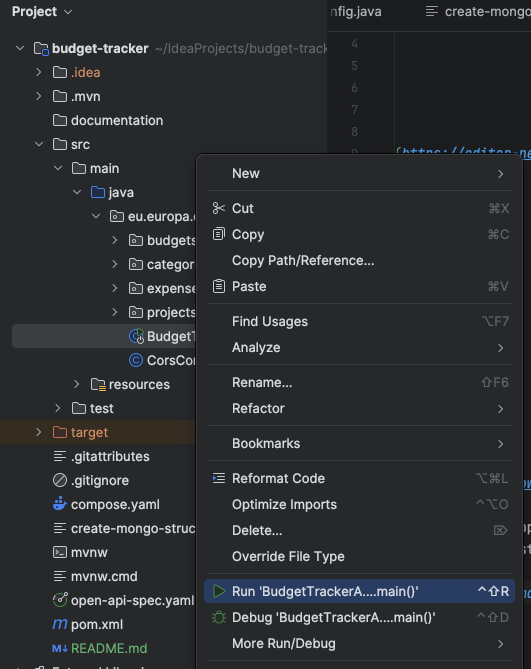

# **Budget Tracker**

A Spring backend service that exeposes the necessary APIs for managing budgets and expenses. With the exposed APIs it's possible to save and retrieve a budget associated to a project, add new expenses, filter expenses by date range, and categorize them using a dropdown whose value are returned by an API.

---

## **APIs**

Copy the [Open API Specification](./open-api-spec.yaml) and paste it into the [Swagger Editor](https://editor-next.swagger.io/) to have a detailed view of the exposed APIs.

---

## **Usage**

Clone this repository locally by running
```shell
  git clone https://github.com/maxflowers89/budget-tracker.git
```

Move into the newly created folder
```shell
  cd budget-tracker
```
The application leverages Java 21 (follow the instruction [here](https://www.oracle.com/de/java/technologies/downloads/) to download and install it) and Spring Boot version 3.4.1

The pom.xml contains the spring-boot-docker-compose dependency that simplifies the deployment of Spring Boot applications and external services (e.g. databases, caches) through Docker compose.
When you start the application, the Mongo DB instance specified in the [compose.yaml](./compose.yaml) will be started alongside the main application, and it needs [Docker](https://docs.docker.com/engine/install/) running on the machine.

Start the application from your IDE (if you use IntelliJ, right-click the [BudgetTrackerApplication.java](src/main/java/eu/europa/ecb/budgettracker/BudgetTrackerApplication.java)) and then click the Run or Debug button as shown below

.

The service will be exposed at http://localhost:8080

To create a project in Mongo DB, connect to it by using the credentials and port in the [compose.yaml](./compose.yaml) and then running the following commands

```javascript
use mydatabase
db.createCollection("projects");
db.projects.insertOne({"_id": 1, "name": "interview-test"});
```

